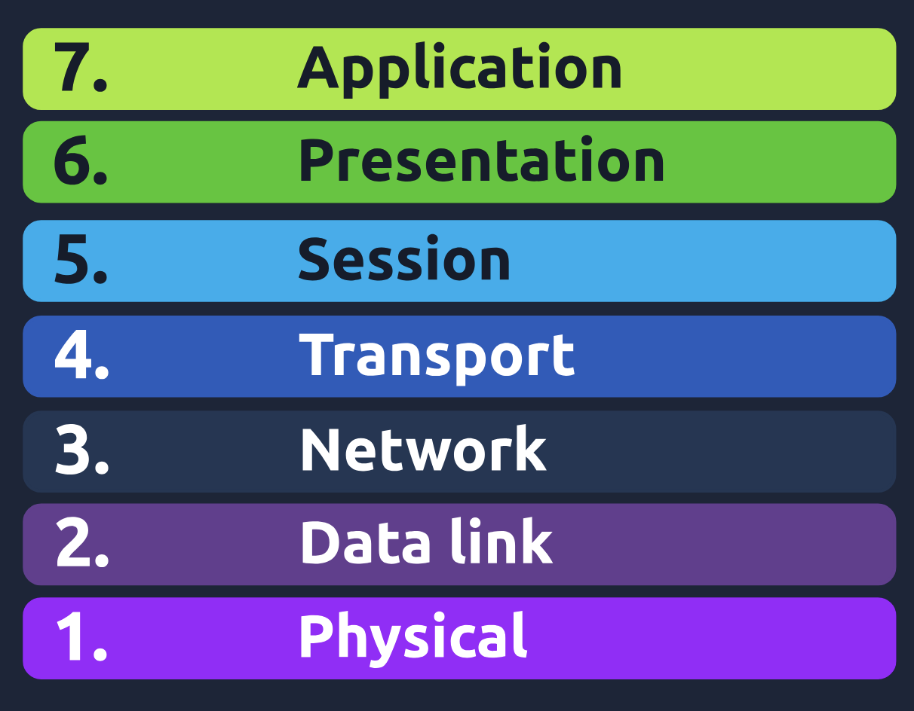
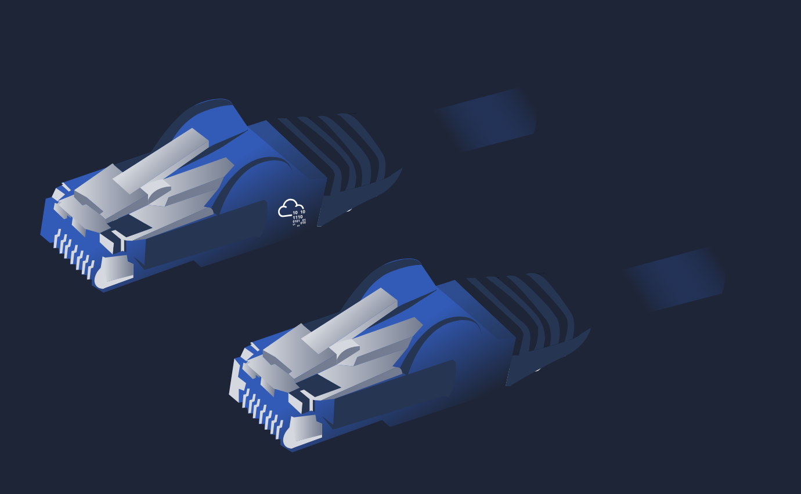
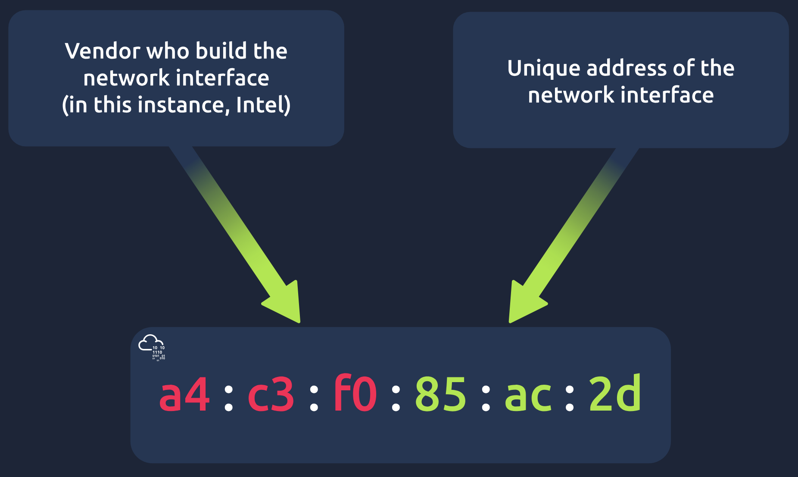
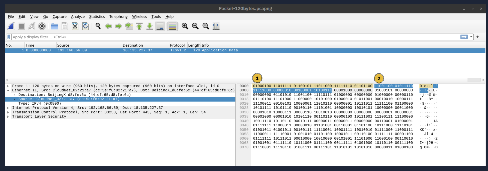
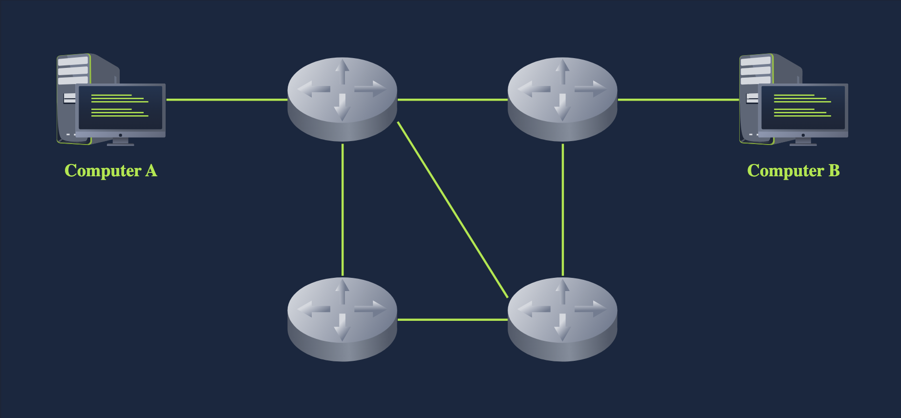

# 🧩 TryHackMe — Networking Walkthrough

## 📅 Date
2025-10-14

## 📝 Description
This walkthrough is dedicated to the **Networking** module on TryHackMe.  
We cover the **OSI model**, key network protocols and commands, as well as practical examples.  

---

## 🔹 OSI Model (Open Systems Interconnection)
The OSI model describes the **structure of network communication**. It consists of 7 layers:

1. Physical Layer  
2. Data Link Layer  
3. Network Layer  
4. Transport Layer  
5. Session Layer  
6. Presentation Layer  
7. Application Layer  

The numbering starts from the Physical layer (1) to the Application layer (7).  
💡 Mnemonic: *“Please Do Not Throw Spinach Pizza Away”* helps remember the layer order.  

---

## 🔹 Layer 1: Physical Layer
The physical layer is responsible for the **physical connection** between devices: cables, antennas, optical fibers, WiFi bands.  
Examples: Ethernet, optical fiber, WiFi (2.4, 5, 6 GHz).

---

## 🔹 Layer 2: Data Link Layer
The data link layer ensures **data transfer between nodes within the same network segment**.  
- Protocols: Ethernet (802.3), WiFi (802.11)  
- MAC addresses: unique device identifiers (6 bytes, hex)

Example of an Ethernet frame with MAC addresses:

---

## 🔹 Layer 3: Network Layer
The network layer is responsible for **data transfer between different networks**.  
- Logical addressing and routing  
- Protocols: IP, ICMP, VPN (IPSec, SSL/TLS)

---

## 🔹 Layer 4: Transport Layer
The transport layer provides **end-to-end communication for applications**: segmentation, flow control, error correction.  
- Examples: TCP, UDP

---

## 🔹 Layer 5: Session Layer
The session layer manages **establishment, maintenance, and synchronization of connections between applications**.  
- Examples: NFS, RPC

---

## 🔹 Layer 6: Presentation Layer
The presentation layer transforms data into a **format understandable by the application**: encoding, compression, encryption.  
- Examples: ASCII, Unicode, JPEG, GIF, PNG, MIME

---

## 🔹 Layer 7: Application Layer
The application layer provides **network services directly to applications**.  
- Example protocols: HTTP, FTP, DNS, POP3, SMTP, IMAP

---

## 📊 Summary Table
| Layer | Function | Example Protocols |
|-------|---------|-----------------|
| 1 Physical | Physical connection | Ethernet cable, WiFi, Fiber |
| 2 Data Link | Communication within a segment | Ethernet, WiFi, MAC |
| 3 Network | Routing and addressing | IP, ICMP, VPN |
| 4 Transport | End-to-end communication | TCP, UDP |
| 5 Session | Session management | NFS, RPC |
| 6 Presentation | Data transformation | ASCII, JPEG, MIME |
| 7 Application | Services for applications | HTTP, FTP, DNS, SMTP |

---

## 📌 Takeaways / Follow-up
- The OSI model simplifies understanding of network protocols  
- Network diagnostic commands (ping, traceroute, ip a, ss) are directly related to different OSI layers  
- Next goal: practical work with TCP/UDP, network interface configuration, packet analysis

---

## 📝 Exercises / Tasks

Here are some example questions from the Networking module and their answers:

1. **Which layer is responsible for end-to-end communication between running applications?**  
**Answer:** 4 — Transport Layer

2. **Which layer is responsible for routing packets to the proper network?**  
**Answer:** 3 — Network Layer

3. **In the OSI model, which layer is responsible for encoding the application data?**  
**Answer:** 6 — Presentation Layer

4. **Which layer is responsible for transferring data between hosts on the same network segment?**  
**Answer:** 2 — Data Link Layer
